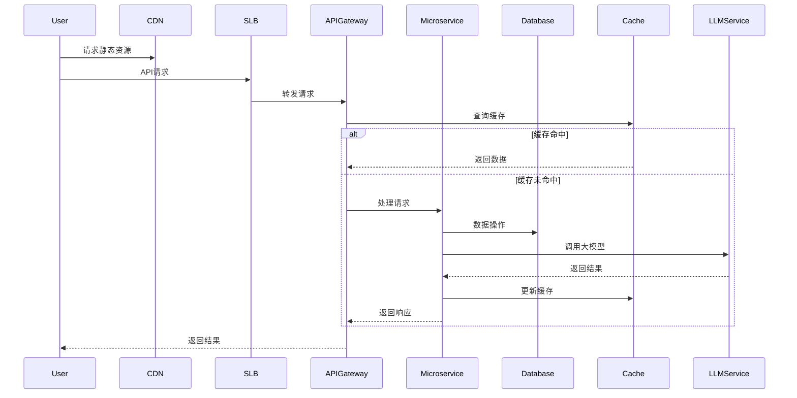
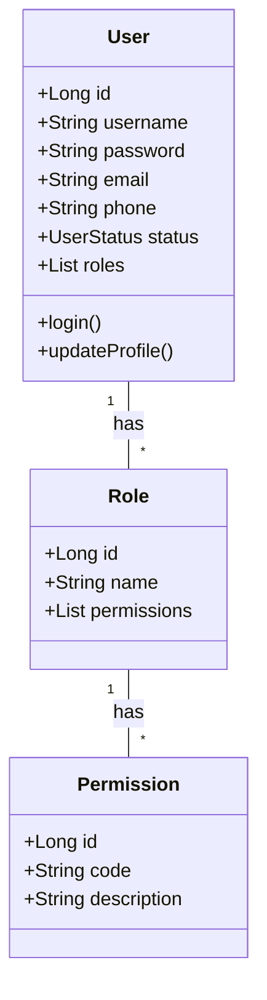
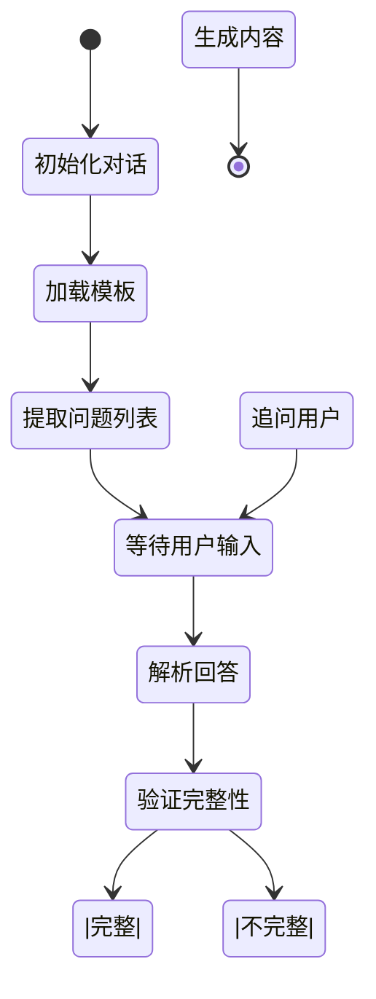
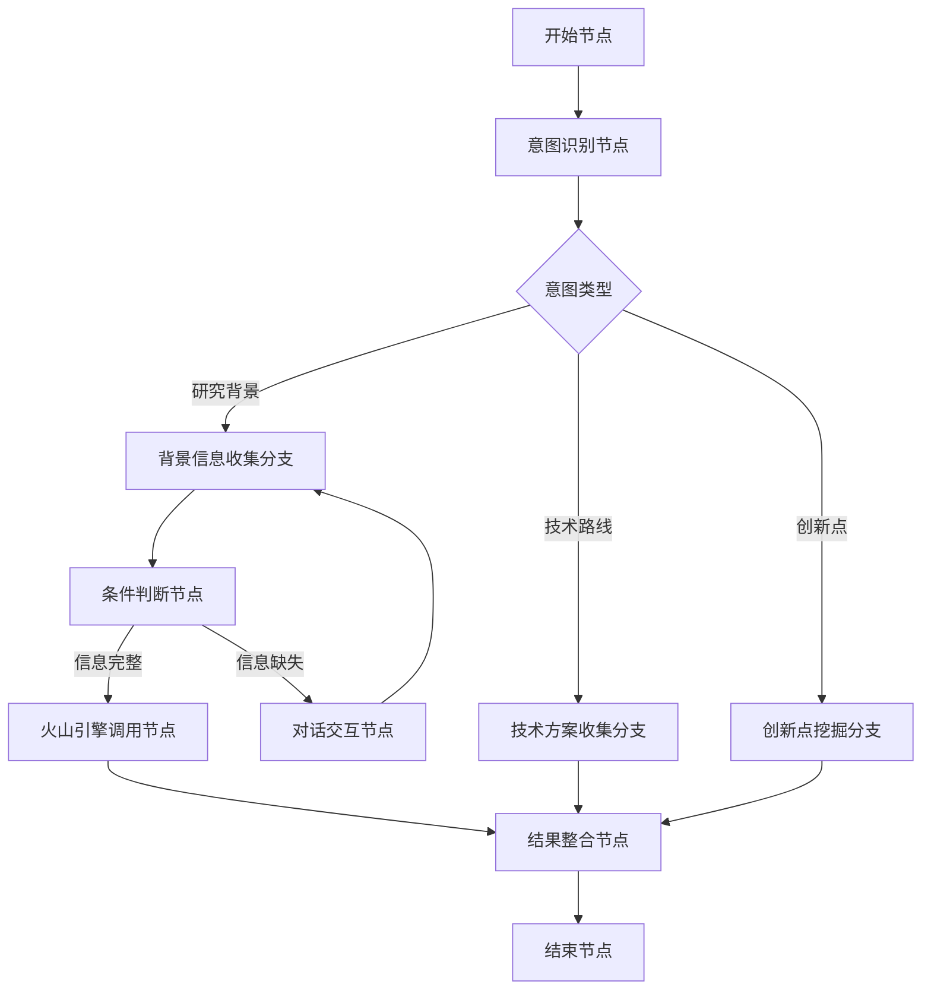
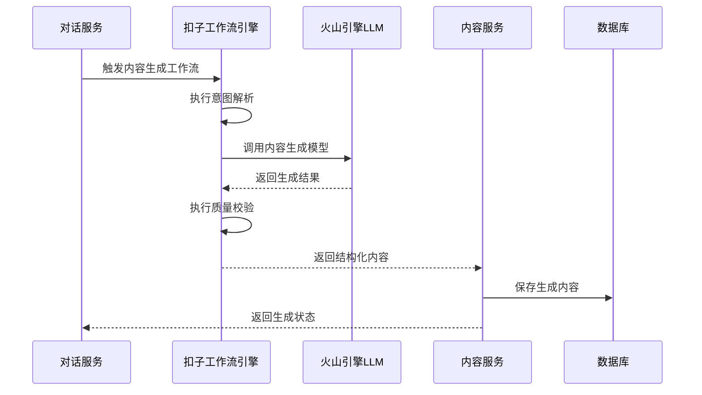

# 智能申报书撰写助手开发文档

## 1. 引言

### 1.1 项目背景
智能申报书撰写助手旨在通过AI技术辅助用户高效完成各类申报材料的撰写，降低撰写门槛，提升文档质量。本开发文档详细描述系统的技术实现方案，为开发团队提供实施指南。

### 1.2 文档范围
本文档涵盖系统架构、模块设计、数据库设计、API接口规范、开发规范、测试策略、部署流程及维护手册等内容，适用于前后端开发人员、测试工程师和运维人员。

### 1.3 技术栈选型
| 技术领域 | 选型方案 | 版本要求 |
|---------|---------|---------|
| 前端框架 | React | ^18.0.0 |
| 后端框架 | Spring Boot | 2.7.x |
| 数据库 | MySQL | 8.0+ |
| 缓存 | Redis | 6.2+ |
| 容器化 | Docker | 20.10+ |
| 编排工具 | Kubernetes | 1.24+ |
| API文档 | Swagger | 3.0+ |

## 2. 系统架构

### 2.1 整体架构


#### 2.1.1 架构分层
- **接入层**：CDN、SLB负载均衡
- **应用层**：API网关、微服务集群
- **数据层**：关系型数据库、缓存、对象存储
- **基础设施层**：阿里云ECS、容器服务

#### 2.1.2 核心组件交互


### 2.2 微服务拆分
系统采用DDD架构思想，按业务领域拆分为以下微服务：

| 服务名称 | 核心功能 | 技术栈 |
|---------|---------|---------|
| 用户服务 | 认证授权、用户管理 | Spring Security、JWT |
| 项目服务 | 项目创建、模板管理 | Spring Boot、MyBatis-Plus |
| 对话服务 | 智能问答、信息收集 | Spring Boot、WebSocket |
| 内容服务 | 申报书生成、编辑 | Spring Boot、Redis |
| 文件服务 | 文件上传、存储管理 | Spring Boot、阿里云OSS |
| 支付服务 | 会员管理、订单支付 | Spring Boot、支付宝SDK |

## 3. 模块设计

### 3.1 用户模块

#### 3.1.1 核心功能
- 用户注册/登录
- 个人信息管理
- 权限控制

#### 3.1.2 类图设计


### 3.2 智能对话模块

#### 3.2.1 对话流程设计


#### 3.2.2 核心算法
- 意图识别：基于BERT的文本分类模型
- 实体提取：BiLSTM-CRF模型提取关键信息
- 对话状态管理：采用有限状态机(FSM)

## 4. 数据库设计

### 4.1 ER图


### 4.2 核心表结构

#### 4.2.1 用户表(users)
| 字段名 | 类型 | 约束 | 说明 |
|-------|------|------|------|
| id | BIGINT | PK | 用户ID |
| username | VARCHAR(50) | NOT NULL, UNIQUE | 用户名 |
| password | VARCHAR(100) | NOT NULL | 加密密码 |
| email | VARCHAR(100) | UNIQUE | 邮箱 |
| phone | VARCHAR(20) | UNIQUE | 手机号 |
| status | TINYINT | NOT NULL | 状态(0-禁用,1-正常) |
| created_at | DATETIME | NOT NULL | 创建时间 |
| updated_at | DATETIME | NOT NULL | 更新时间 |

#### 4.2.2 项目表(project)
| 字段名 | 类型 | 约束 | 说明 |
|-------|------|------|------|
| id | BIGINT | PK | 项目ID |
| user_id | BIGINT | FK | 用户ID |
| template_id | BIGINT | FK | 模板ID |
| title | VARCHAR(200) | NOT NULL | 项目标题 |
| status | TINYINT | NOT NULL | 状态(0-草稿,1-进行中,2-完成) |
| progress | INT | NOT NULL | 进度(0-100) |
| created_at | DATETIME | NOT NULL | 创建时间 |
| updated_at | DATETIME | NOT NULL | 更新时间 |

#### 4.2.3 申报书内容表(application_content)
| 字段名 | 类型 | 约束 | 说明 |
|-------|------|------|------|
| id | BIGINT | PK | 内容ID |
| project_id | BIGINT | FK | 项目ID |
| section_id | BIGINT | FK | 章节ID |
| content | LONGTEXT | | 章节内容 |
| word_count | INT | | 字数统计 |
| created_at | DATETIME | NOT NULL | 创建时间 |
| updated_at | DATETIME | NOT NULL | 更新时间 |

### 4.3 索引设计
| 表名 | 索引类型 | 字段 | 用途 |
|------|---------|------|------|
| users | 唯一索引 | username, email, phone | 登录查询 |
| project | 普通索引 | user_id | 用户项目查询 |
| application_content | 联合索引 | project_id, section_id | 内容查询 |

## 5. API接口规范

### 5.1 接口设计原则
- RESTful风格设计
- 版本控制：URL路径包含版本号(/api/v1/...)
- 统一响应格式
- 权限验证：JWT令牌认证

### 5.2 通用响应格式
```json
{
  "code": 200,
  "message": "success",
  "data": {},
  "timestamp": 1620000000000
}
```

### 5.3 核心API定义

#### 5.3.1 用户认证接口
- **登录**
  - URL: `/api/v1/auth/login`
  - 方法: POST
  - 请求体:
    ```json
    {
      "username": "string",
      "password": "string"
    }
    ```
  - 响应体:
    ```json
    {
      "code": 200,
      "message": "success",
      "data": {
        "token": "string",
        "expiresIn": 86400,
        "user": {
          "id": 1,
          "username": "string",
          "roles": ["string"]
        }
      },
      "timestamp": 1620000000000
    }
    ```

#### 5.3.2 项目管理接口
- **创建项目**
  - URL: `/api/v1/projects`
  - 方法: POST
  - 请求头: Authorization: Bearer {token}
  - 请求体:
    ```json
    {
      "title": "项目标题",
      "templateId": 1
    }
    ```
  - 响应体:
    ```json
    {
      "code": 200,
      "message": "success",
      "data": {
        "id": 1,
        "title": "项目标题",
        "status": 0,
        "progress": 0
      },
      "timestamp": 1620000000000
    }
    ```

## 6. 开发规范

### 6.1 前端开发规范
#### 6.1.1 目录结构
```
src/
├── assets/        # 静态资源
├── components/    # 公共组件
├── pages/         # 页面组件
├── services/      # API服务
├── utils/         # 工具函数
├── hooks/         # 自定义hooks
├── context/       # 全局状态
├── routes/        # 路由配置
└── styles/        # 全局样式
```

#### 6.1.2 命名规范
- 组件: PascalCase (如: ProjectList)
- 函数: camelCase (如: handleSubmit)
- CSS类名: kebab-case (如: project-card)
- 文件命名: 组件文件PascalCase，其他camelCase

### 6.2 后端开发规范
#### 6.2.1 目录结构
```
src/
├── main/
│   ├── java/com/example/
│   │   ├── config/        # 配置类
│   │   ├── controller/    # 控制器
│   │   ├── service/       # 服务接口
│   │   ├── service/impl/  # 服务实现
│   │   ├── repository/    # 数据访问
│   │   ├── model/         # 数据模型
│   │   ├── dto/           # 数据传输对象
│   │   ├── util/          # 工具类
│   │   └── Application.java
│   └── resources/
│       ├── application.yml
│       ├── application-dev.yml
│       └── application-prod.yml
└── test/                  # 测试代码
```

#### 6.2.2 代码规范
- 类名: PascalCase
- 方法名/变量名: camelCase
- 常量: UPPER_SNAKE_CASE
- 包名: 全小写
- 注释: Javadoc规范

## 7. 测试策略

### 7.1 测试类型
- **单元测试**: 覆盖核心业务逻辑，目标覆盖率>80%
- **集成测试**: 验证服务间交互
- **接口测试**: 验证API功能完整性
- **性能测试**: 验证系统响应时间和并发能力
- **安全测试**: 验证认证授权、数据加密等安全措施

### 7.2 性能测试指标
- 响应时间: P95 < 1s，P99 < 3s
- 并发能力: 支持500 QPS，峰值1000 QPS
- 稳定性: 72小时连续运行无故障

### 7.3 自动化测试
- 单元测试: JUnit 5 + Mockito
- 接口测试: Postman + Newman
- 前端测试: Jest + React Testing Library
- CI/CD集成: Jenkins pipeline自动执行测试

## 8. 部署流程

### 8.1 环境准备
- 开发环境: 本地Docker容器
- 测试环境: 阿里云测试集群
- 生产环境: 阿里云生产集群

### 8.2 部署架构


### 8.3 CI/CD流程


### 8.4 部署步骤
1. 代码合并至主分支触发CI流程
2. 构建Docker镜像并推送至阿里云容器镜像服务
3. 更新Kubernetes部署配置
4. 执行kubectl apply部署应用
5. 验证部署状态和服务健康度

## 9. 维护手册

### 9.1 日常维护
- 每日监控系统健康状态
- 每周数据备份检查
- 每月安全漏洞扫描

### 9.2 常见问题处理
| 问题现象 | 可能原因 | 解决方案 |
|---------|---------|---------|
| API响应超时 | 数据库慢查询 | 优化SQL，添加索引 |
| 大模型调用失败 | API密钥过期 | 更新密钥，检查网络 |
| 服务不可用 | 节点资源耗尽 | 扩容节点，优化资源配置 |

### 9.3 日志管理
- 日志收集: ELK Stack
- 日志级别: ERROR/WARN/INFO/DEBUG
- 日志保存: 线上环境保存30天，重要日志归档1年

## 10. 附录

### 10.1 缩略语表
| 缩略语 | 全称 |
|-------|------|
| API | Application Programming Interface |
| CDN | Content Delivery Network |
| JWT | JSON Web Token |
| LLM | Large Language Model |
| SLB | Server Load Balancer |

### 10.2 参考资料
- 《阿里云容器服务K8s最佳实践》
- 《Spring Boot实战》
- 《RESTful Web API设计》
### 3.2 智能对话模块（更新）

#### 3.2.2 核心算法（更新）
- **意图理解**：基于扣子工作流的意图识别框架，通过可视化工作流定义意图分类与实体提取规则
- **对话管理**：采用扣子工作流引擎实现多轮对话逻辑，支持条件分支、循环、动态跳转等复杂流程控制
- **文本生成**：通过扣子工作流串联多模型调用，实现"意图解析→模板选择→内容生成→质量校验"的完整流程

#### 3.2.3 扣子工作流集成方案
扣子工作流作为智能体核心引擎，负责协调意图理解、多轮对话和内容生成的完整流程：

##### 3.2.3.1 工作流设计架构


工作流核心节点类型：
- **意图识别节点**：配置意图分类模型和实体提取规则
- **条件判断节点**：基于实体值或上下文属性执行分支逻辑
- **大模型调用节点**：配置火山引擎/扣子大模型参数和提示词模板
- **对话交互节点**：定义追问话术和用户输入验证规则
- **结果整合节点**：汇总多轮对话数据并生成结构化输出

##### 3.2.3.2 工作流配置示例（申报书章节撰写流程）


##### 3.2.3.3 与后端服务集成方式
1. **工作流引擎接入**：
```java
// 扣子工作流API调用示例
public class KouziWorkflowClient {
    @Value("${kouzi.api.key}")
    private String apiKey;
    
    @Value("${kouzi.api.endpoint}")
    private String endpoint;
    
    public WorkflowResult executeWorkflow(String workflowId, Map<String, Object> context) {
        // 构建请求参数
        WorkflowRequest request = new WorkflowRequest();
        request.setWorkflowId(workflowId);
        request.setContext(context);
        request.setTraceId(UUID.randomUUID().toString());
        
        // 调用扣子工作流API
        return restTemplate.postForObject(
            endpoint + "/api/v1/workflows/execute",
            request,
            WorkflowResult.class
        );
    }
}
```

2. **数据交互格式**：
```json
// 工作流输入上下文
{
  "userInput": "我的研究基于深度学习技术",
  "projectId": 123,
  "sectionId": 456,
  "conversationHistory": [
    {"role": "user", "content": "我要写研究背景章节"},
    {"role": "assistant", "content": "请描述您的研究基础"}
  ],
  "entities": {"technology": "深度学习", "domain": "人工智能"}
}

// 工作流输出结果
{
  "resultCode": "SUCCESS",
  "outputData": {
    "intent": "technology_background",
    "entities": {"technology": "深度学习", "domain": "人工智能", "method": "神经网络"},
    "nextAction": "GENERATE_CONTENT",
    "promptTemplate": "基于{technology}技术在{domain}领域的应用，撰写研究背景..."
  },
  "conversationResponse": "已理解您的研究基础，正在生成研究背景章节..."
}
```

### 3.3 内容服务模块（新增）

#### 3.3.1 基于扣子工作流的文本生成流程
内容服务通过调用扣子工作流实现申报书内容的智能生成，流程如下：



#### 3.3.2 工作流模板管理
系统内置多种申报书撰写工作流模板，支持自定义扩展：

| 工作流模板 | 适用场景 | 包含节点数 | 平均执行时长 |
|-----------|---------|-----------|------------|
| 研究背景生成 | 项目申报书背景章节 | 8 | 25秒 |
| 技术路线设计 | 技术方案章节 | 12 | 40秒 |
| 创新点提炼 | 创新点总结章节 | 6 | 18秒 |
| 全文档生成 | 完整申报书撰写 | 35 | 3分钟 |

## 2.2 微服务拆分（更新）

| 服务名称 | 核心功能 | 技术栈 | 新增内容 |
|---------|---------|---------|---------|
| 对话服务 | 智能问答、信息收集 | Spring Boot、WebSocket | 集成扣子工作流客户端 |
| 内容服务 | 申报书生成、编辑 | Spring Boot、Redis | 工作流模板管理、内容质量校验 |
| 工作流服务 | 工作流执行与监控 | Spring Boot、Elasticsearch | 新增服务：负责扣子工作流引擎对接、工作流实例管理、执行日志分析 |

## 5. API接口规范（更新）

### 5.3 核心API定义（新增）

#### 5.3.3 工作流管理接口
- **执行工作流**
  - URL: `/api/v1/workflows/execute`
  - 方法: POST
  - 请求头: Authorization: Bearer {token}
  - 请求体:
    ```json
    {
      "workflowId": "research_background_v1",
      "context": {
        "userInput": "我的研究基于深度学习技术",
        "projectId": 123,
        "sectionId": 456
      },
      "traceId": "uuid-string"
    }
    ```
  - 响应体:
    ```json
    {
      "code": 200,
      "message": "success",
      "data": {
        "resultCode": "SUCCESS",
        "outputData": {
          "intent": "technology_background",
          "entities": {"technology": "深度学习", "domain": "人工智能"},
          "nextAction": "GENERATE_CONTENT",
          "promptTemplate": "基于{technology}技术在{domain}领域的应用..."
        },
        "executionId": "wf-exe-789",
        "executionTime": 2500
      },
      "timestamp": 1620000000000
    }
    ```

#### 5.3.4 工作流模板接口
- **获取工作流模板列表**
  - URL: `/api/v1/workflow-templates`
  - 方法: GET
  - 请求头: Authorization: Bearer {token}
  - 响应体:
    ```json
    {
      "code": 200,
      "message": "success",
      "data": [
        {
          "id": "research_background_v1",
          "name": "研究背景生成",
          "description": "用于申报书研究背景章节的智能生成",
          "nodes": 8,
          "avgExecutionTime": 2500,
          "updateTime": "2023-10-15T10:30:00Z"
        },
        // 更多模板...
      ],
      "timestamp": 1620000000000
    }
    ```

## 7. 测试策略（更新）

### 7.1 测试类型（新增）
- **工作流测试**: 验证工作流节点配置正确性、分支逻辑完整性
- **工作流性能测试**: 验证工作流并发执行能力，目标支持100并发工作流实例

### 7.4 工作流测试示例
```java
// 工作流测试用例示例
@Test
public void testResearchBackgroundWorkflow() {
    // 准备测试数据
    Map<String, Object> context = new HashMap<>();
    context.put("userInput", "基于区块链技术的供应链金融研究");
    context.put("projectId", 1L);
    
    // 执行工作流
    WorkflowResult result = workflowService.executeWorkflow("research_background_v1", context);
    
    // 验证结果
    assertEquals("SUCCESS", result.getResultCode());
    assertNotNull(result.getOutputData().get("intent"));
    assertTrue(result.getExecutionTime() < 3000); // 验证执行时长
}
```

## 8. 部署流程（更新）

### 8.4 部署步骤（新增）
6. 配置扣子工作流引擎连接参数
   ```yaml
   # 扣子工作流配置
   kouzi:
     api:
       key: ${KOUZI_API_KEY}
       endpoint: https://workflow.kouzi.com
       timeout: 30000
     workflow:
       defaultTimeout: 60000
       asyncCallbackUrl: ${APP_DOMAIN}/api/v1/workflows/callback
   ```
7. 导入初始工作流模板
   ```bash
   # 导入工作流模板脚本
   java -jar workflow-cli.jar import --dir ./workflow-templates --overwrite
   ```